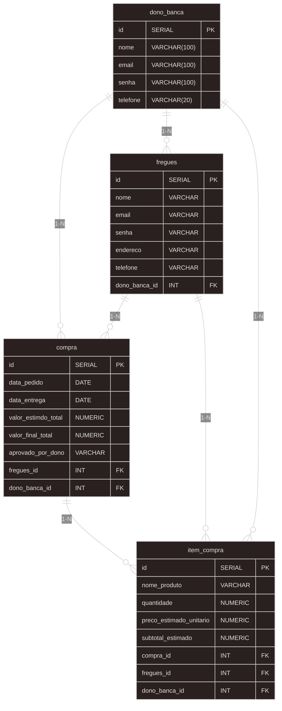
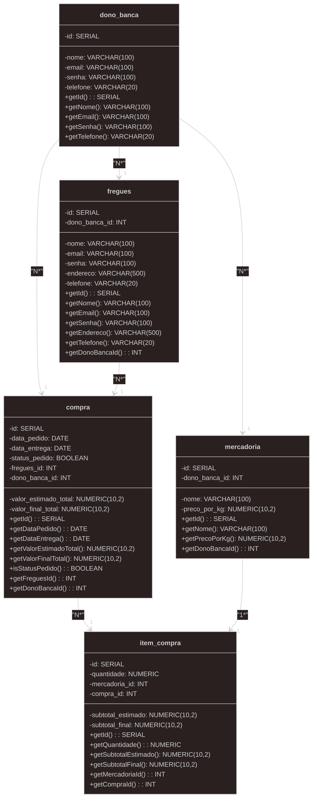
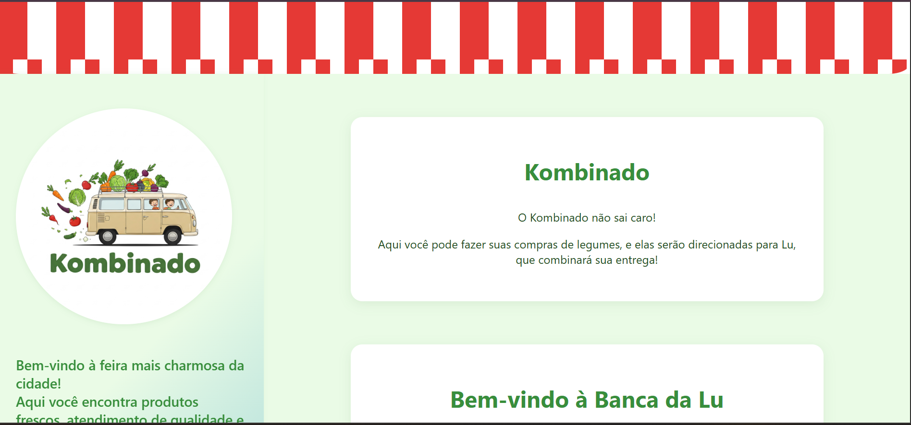
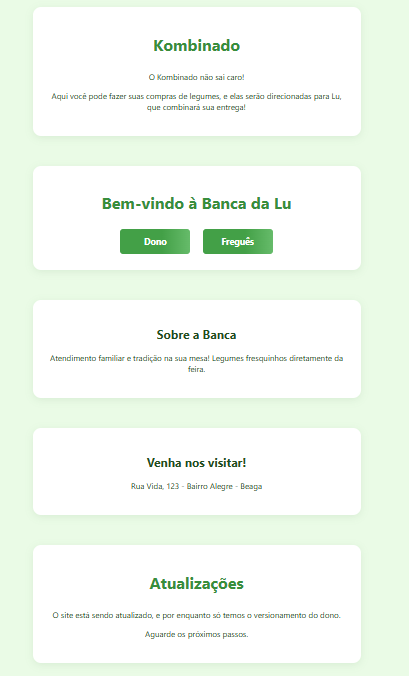
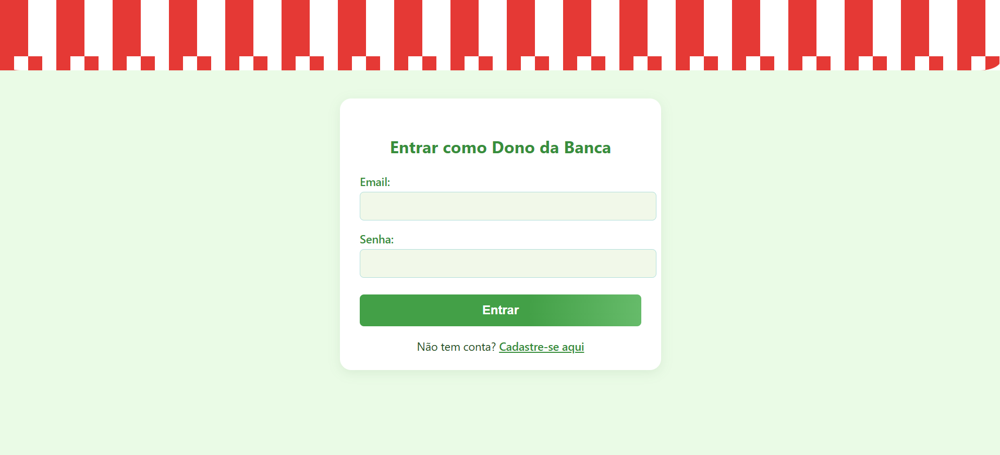
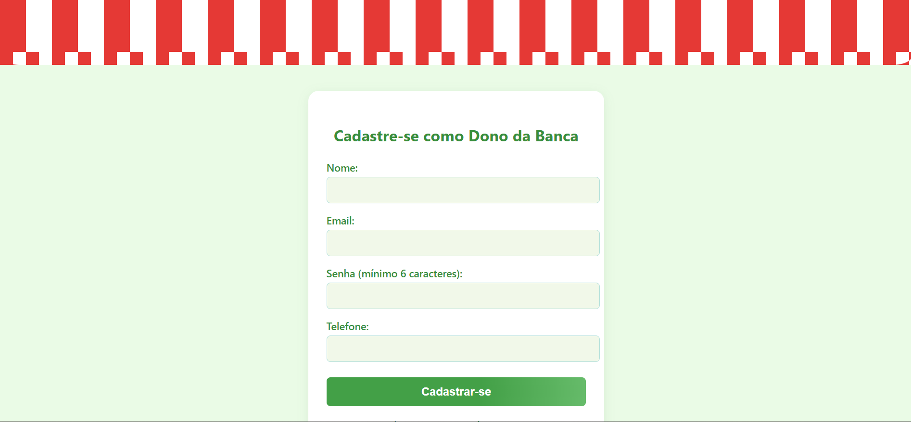
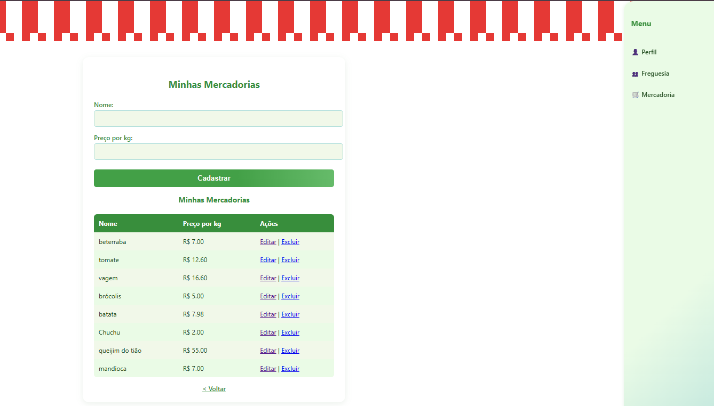
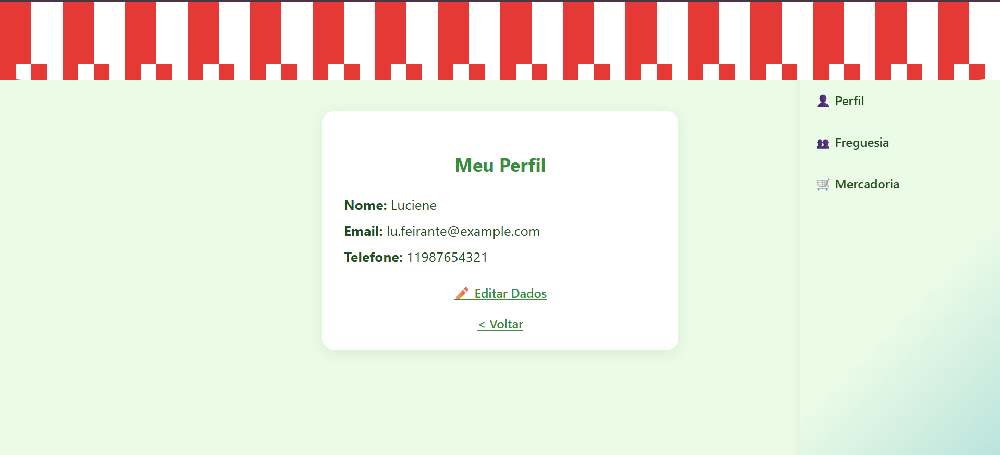
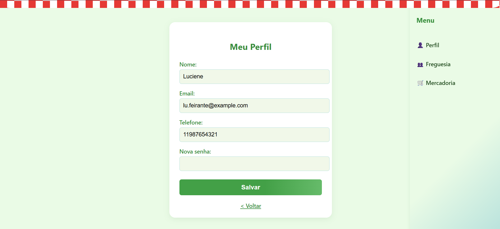
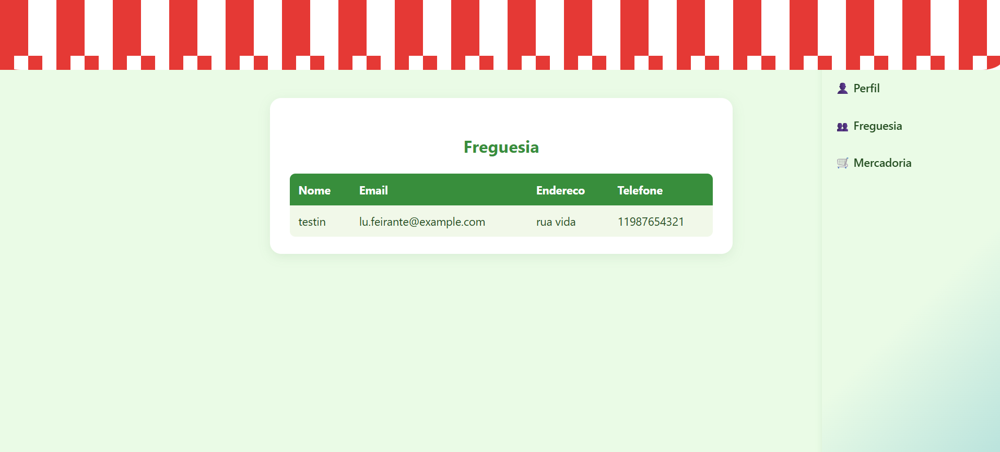

# Web Application Document - Projeto Individual - Módulo 2 - Inteli

**_Os trechos em itálico servem apenas como guia para o preenchimento da seção. Por esse motivo, não devem fazer parte da documentação final._**

## Kombinado

#### Maria Eduarda Barbosa Oliveira

## Sumário

1. [Introdução](#c1)  
2. [Visão Geral da Aplicação Web](#c2)  
3. [Projeto Técnico da Aplicação Web](#c3)  
4. [Desenvolvimento da Aplicação Web](#c4)  
5. [Referências](#c5)  

<br>

## <a name="c1"></a>1. Introdução

O projeto Kombinado surge como uma resposta inovadora e prática para otimizar a gestão de pedidos na Barraca da Lu, uma tradicional feira de rua onde a simpatia e a qualidade dos legumes da Lu conquistaram uma clientela fiel. Observando o crescente volume de pedidos realizados através de canais informais, como o WhatsApp pessoal da Lu, e a necessidade de um fluxo de trabalho mais eficiente, a aplicação web Kombinado se propõe a centralizar e simplificar o processo de encomenda tanto para a feirante quanto para seus fregueses.

Em sua essência, o Kombinado visa transformar a maneira como os pedidos são realizados e gerenciados. Para o cliente, a aplicação oferecerá uma interface intuitiva e amigável, ressaltando que seu principal versionamaento é para utilização mobile, havendo versionamento desktop, onde será possível navegar por um catálogo digital dos legumes frescos disponíveis na Barraca da Lu. Cada produto será acompanhado de seu preço atualizado, permitindo ao freguês selecionar as quantidades desejadas e visualizar o valor total de sua compra em tempo real. Além disso, o sistema proporcionará transparência ao informar o status de cada pedido, desde a confirmação até a preparação para entrega ou retirada. Essa ideia surge como um movimento de comodidade, em que o cliente poderá fazer seu pedido com antecedência, considerando suas rotinas agitadas ou seu anseio por praticidade em um mundo automatizado.

Do ponto de vista da Dona Lu, a aplicação Kombinado se apresenta como uma ferramenta poderosa para a organização e o crescimento de seu empreendimento. Através de um painel de controle dedicado, ela poderá gerenciar o catálogo de produtos, incluindo a adição de novos itens, a atualização de preços de forma rápida e eficiente, e o controle do estoque disponível. A visualização centralizada de todos os pedidos recebidos facilitará o planejamento da separação dos produtos e a organização das entregas, otimizando o tempo da barraca. 

O nome "Kombinado" evoca as raízes de sua barraca, já que seu meio de locomoção para o trabalho, para carregar todas as mercadorias e as bancas, é uma Kombi, que possui diversos anos contados na casa, quase o mesmo tempo que Lu trabalha no ramo. Juntou-se o útil ao agradável, onde o veículo icônico e amplamente conhecido pela freguesia traz essa ideia de movimento e também de entregas, que é o objetivo principal do projeto. A aplicação não apenas facilitará as transações comerciais, mas também fortalecerá a presença da Barraca da Lu no universo digital, impulsionando a eficiência e a satisfação de todos os envolvidos, com uma melhor gestão do trabalho.


---

## <a name="c2"></a>2. Visão Geral da Aplicação Web

### 2.1. Personas (Semana 01 - opcional)

*Posicione aqui sua(s) Persona(s) em forma de texto markdown com imagens, ou como imagem de template preenchido. Atualize esta seção ao longo do módulo se necessário.*

### 2.2. User Stories (Semana 01 - opcional)

*Posicione aqui a lista de User Stories levantadas para o projeto. Siga o template de User Stories e utilize a referência USXX para numeração (US01, US02, US03, ...). Indique todas as User Stories mapeadas, mesmo aquelas que não forem implementadas ao longo do projeto. Não se esqueça de explicar o INVEST de 1 User Storie prioritária.*

---

## <a name="c3"></a>3. Projeto da Aplicação Web
A presente seção detalha as informações técnicas e a perspectiva macro do projeto da aplicação web "Kombinado". Serão apresentados os elementos da arquitetura concebida para o desenvolvimento do sistema, proporcionando uma visão abrangente da sua estrutura e organização.

### 3.1. Modelagem do banco de dados

A modelagem do banco de dados existe para explicar as regras de negócio, ou seja, para expicar as relações que devem existir dentro da modelagem do banco de dados. É possível ter uma perspectiva visual do banco de dados, crinado uma consistência maior para criação do banco em questão, e não apenas isso, mas também ter de maneira organizada o projeto em questão, a partir dos relacionamentos existentes, com alguns atributos e campos-chave.



No diagrama apresentado acima, é possível entender as principais regras de negócio da aplicação web, cujo objetivo é permitir a encomenda de verduras. O freguês realizará o login com seus dados e fará um ou mais pedidos, selecionando os itens desejados e adicionando informações de entrega, como a data do pedido e a data de entrega prevista. A tabela _compra_ armazenará os valores estimados e finais do pedido, além do status de aprovação do dono da banca, que indicará se o pedido foi aprovado, recusado ou entregue. Cada item do pedido terá sua identificação única, nome, quantidade solicitada, preço por quilo e subtotal estimado.

Analisando mais detalhadamente a estrutura das tabelas, observamos as relações estabelecidas por meio de chaves estrangeiras.

Cada tabela possui uma chave primária como elemento principal, responsável por identificar unicamente cada registro. Adicionalmente, algumas tabelas contam com chaves estrangeiras, como é o caso da tabela _compra_, _fregues_ e _item_compra.

Ao explorarmos as chaves estrangeiras, encontramos o atributo "_dono_banca_id_" na tabela _fregues_ conecta os fregueses ao dono da banca responsável por eles. Essa relação garante que o proprietário tenha acesso aos detalhes do cliente e consequentemente do pedido para sua devida gestão.

De maneira similar, há o atributo "_fregues_id_" na tabela _compra_, que estabelece uma ligação com as informações da tabela _fregues_, relacionando cada compra ao cliente específico de forma concisa.

Por fim, a chave estrangeira "_compra_id_" na tabela _item_compra_ permite que múltiplos itens sejam associados a uma única compra.

Em uma visão macro, é importante notar que um freguês pode realizar diversas compras, um dono de banca pode gerenciar múltiplos fregueses e seus respectivos pedidos, e uma compra pode conter vários itens de compra.

#### Modelo SQL da tabela `compra`

Abaixo, apresentamos um trecho da modelagem em código SQL. O código completo pode ser encontrado em ..\documentos\wad.mdn. O objetivo deste exemplo é ilustrar como o diagrama do banco de dados é traduzido para a linguagem de programação SQL. Os comentários no código visam facilitar a compreensão da função e dos parâmetros de cada elemento da tabela, conforme detalhado anteriormente.

```sql
-- Criação da tabela compra
CREATE TABLE IF NOT EXISTS compra (
    id SERIAL PRIMARY KEY, -- criação de uma chave de identificação
    data_pedido DATE NOT NULL,
    data_entrega DATE NOT NULL,
    valor_estimdo_total NUMERIC(10,2) NOT NULL, -- definição de inserção numérica som 10 dígitos máximos e 2 casas decimais (dinheiro)
    valor_final_total NUMERIC(10,2) NOT NULL,
    aprovado_por_dono VARCHAR (20) NOT NULL,
    fregues_id INT,
    FOREIGN KEY id_fregues REFERENCES fregues(id) -- chave estrangeira, que permite relação com a tabela de origem
);
```
Para acessar o código completo: [clique aqui](../scripts/202505091332_init.sql)


### 3.1.1 BD e Models (Semana 5)

#### Banco de Dados e Models

O banco de dados do projeto Kombinado foi modelado para refletir a usabilidade de nossa personagem principal, a Lu. As tabelas principais são: `dono_banca`, `fregues`, `compra`, `item_compra` e `mercadoria`. Cada tabela possui sua chave primária e, quando necessário, chaves estrangeiras para garantir a integridade referencial.
Atualmente, a interface é totalmente voltada para uma única dona de Banca, então toda aplicação é baseada e feita "sob medida" para ela.

**Principais tabelas:**
- **dono_banca**: armazena os dados do dono da banca (nome, email, senha, telefone).
- **fregues**: representa os clientes, vinculados ao dono da banca.
- **mercadoria**: produtos disponíveis para venda, cada um associado a um dono de banca, que será responsável pela inserção e atualização de produtos.
- **compra**: pedidos realizados pelos fregueses, com informações de datas, valores e status (que depende da aprovação do dono).
- **item_compra**: itens individuais de cada compra, vinculados à compra, mercadoria e freguês.

**Modelo Relacional:**

Abaixo será possível entender os relacionamentos das tabelas, e como funciona a regra de negócio em relação ao relacionamento.



#### Models implementados

A camada de models utiliza o pacote [Joi](https://joi.dev/) para validação dos dados recebidos pela aplicação. Cada entidade possui um model correspondente, garantindo que os dados estejam no formato correto antes de serem persistidos no banco.

**Exemplo de Model**

- **DonoBancaModel**
    ```js
    const Joi = require('joi');
    class DonoBancaModel {
            static get schema() {
                    return Joi.object({
                            nome: Joi.string().max(100).required(),
                            email: Joi.string().email().max(100).required(),
                            senha: Joi.string().min(6).max(100).required(),
                            telefone: Joi.string().max(20).required()
                    });
            }
    }
    ```

Esses models garantem a integridade dos dados e facilitam a manutenção e evolução do sistema, já que garantem que seja respeitado o que foi definido como regra de inserção de dados, evitando eventuais falhas.

### 3.2. Arquitetura

A arquitetura da aplicação Kombinado segue o padrão MVC expandido, promovendo uma separação clara de responsabilidades entre as camadas do sistema. O fluxo de dados e responsabilidades pode ser representado conforme abaixo:

```
Usuário (Frontend)
      ⇅
   Rotas (Route)
      ⇅
 Controller
      ⇅
  Service
      ⇅
Repository
      ⇅
   Model
      ⇅
Banco de Dados
```

**Descrição das camadas:**
- **Banco de Dados:**  
  Responsável pelo armazenamento persistente das informações, como donos de banca, fregueses, mercadorias, compras e itens de compra. Utiliza tabelas relacionais com chaves primárias e estrangeiras para garantir integridade e relacionamentos.

- **Model:**  
  Define a estrutura dos dados e suas validações (utilizando, por exemplo, o pacote Joi). Garante que apenas dados válidos sejam processados e enviados ao banco.

- **Repository:**  
  Camada responsável por toda a comunicação com o banco de dados. Realiza operações de CRUD (Create, Read, Update, Delete) e isola o acesso aos dados, facilitando manutenção e testes.

- **Service:**  
  Centraliza a lógica de negócio da aplicação. Orquestra as operações entre controllers e repositórios, aplicando regras e validações específicas do domínio.

- **Controller:**  
  Recebe as requisições HTTP das rotas, valida os dados de entrada, chama os serviços necessários e prepara a resposta para o usuário (renderizando views ou retornando JSON).

- **Route:**  
  Define os endpoints da aplicação, associando URLs e métodos HTTP aos controllers correspondentes.

- **Frontend (View):**  
  Responsável pela interface com o usuário, seja via páginas EJS (renderizadas no backend) ou componentes React (no frontend). Exibe informações, recebe entradas do usuário e envia requisições para o backend.

#### Fluxo de uma requisição típica:

1. O **usuário** interage com a interface (Frontend/View).
2. Uma requisição HTTP é enviada para uma **rota** específica.
3. A **rota** direciona a requisição para o **controller** correspondente.
4. O **controller** processa a requisição, valida os dados e chama o **service**.
5. O **service** executa a lógica de negócio e, se necessário, utiliza o **repository** para acessar ou modificar dados no **banco de dados** via **model**.
6. O resultado retorna pelo mesmo caminho, até chegar novamente ao **frontend**, que exibe a resposta ao usuário.

Essa arquitetura modular facilita a manutenção, testes e evolução do sistema, permitindo que cada camada seja desenvolvida e ajustada de forma independente, promovendo clareza e organização no desenvolvimento da aplicação Kombinado.

### 3.3. Wireframes (Semana 03 - opcional)

*Posicione aqui as imagens do wireframe construído para sua solução e, opcionalmente, o link para acesso (mantenha o link sempre público para visualização).*

### 3.4. Guia de estilos (Semana 05 - opcional)

*Descreva aqui orientações gerais para o leitor sobre como utilizar os componentes do guia de estilos de sua solução.*


### 3.5. Protótipo de alta fidelidade (Semana 05 - opcional)

*Posicione aqui algumas imagens demonstrativas de seu protótipo de alta fidelidade e o link para acesso ao protótipo completo (mantenha o link sempre público para visualização).*

### 3.6. WebAPI e endpoints (Semana 05)

Endpoints são URLs específicas que permitem a comunicação com uma API. Cada endpoint:

- Representa uma operação do sistema (criar, ler, atualizar ou deletar dados)  
- Combina um **método HTTP** (GET, POST, PUT, DELETE) com um **caminho** (ex: `/fregueses`)  
- Segue o padrão REST para integração entre aplicações

Abaixo estão detalhados todos os endpoints disponíveis na API, organizados por funcionalidade.

#### Endpoints da API

##### Donos de Banca
- **GET** `/donos` - Lista todos os donos de banca
- **GET** `/donos/:id` - Obtém um dono de banca específico pelo ID
- **POST** `/donos` - Cria um novo dono de banca
- **PUT** `/donos/:id` - Atualiza um dono de banca existente
- **DELETE** `/donos/:id` - Remove um dono de banca

##### Fregueses
- **GET** `/fregueses` - Lista todos os fregueses
- **GET** `/fregueses/:id` - Obtém um freguês específico pelo ID
- **POST** `/fregueses` - Cria um novo freguês
- **PUT** `/fregueses/:id` - Atualiza um freguês existente
- **DELETE** `/fregueses/:id` - Remove um freguês

##### Compras
- **GET** `/compras` - Lista todas as compras
- **GET** `/compras/:id` - Obtém uma compra específica pelo ID
- **POST** `/compras` - Cria uma nova compra
- **PUT** `/compras/:id` - Atualiza uma compra existente
- **DELETE** `/compras/:id` - Remove uma compra

##### Itens de Compra
- **GET** `/itens-compra` - Lista todos os itens de compra
- **GET** `/itens-compra/:id` - Obtém um item de compra específico pelo ID
- **POST** `/itens-compra` - Cria um novo item de compra
- **PUT** `/itens-compra/:id` - Atualiza um item de compra existente
- **DELETE** `/itens-compra/:id` - Remove um item de compra

#### Exemplos de Requisições

##### Criar um Freguês (POST)
```json
{
  "nome": "Afonsinho",
  "email": "Afonsinho@exemplo.com",
  "senha": "senha123",
  "endereco": "Inteli, 123",
  "telefone": "11999999999",
  "dono_banca_id": 3
}
``` 

### 3.7 Interface e Navegação (Semana 07)

#### Tela Inicial - Kombinado

<div align="center">
   <sub>Imagem 1: Tela 1</sub><br>
   <br>
   <sup>Fonte: Maria Eduarda, 2025 (Autoral)</sup>
 </div>

Essa é a primeira tela vista ao entrar no site Kombinado, onde é apresentada um pouco da aplicação.

<div align="center">
   <sub>Imagem 2: Continuação do Scroll</sub><br>
   <br>
   <sup>Fonte: Maria Eduarda, 2025 (Autoral)</sup>
 </div>

 Essa imagem é um corte da continuação da tela 1, onde são apresentados mais detalhes sobre a aplicação, com botões para as outras telas, e nesse caso, para a página do dono, que é o que foi desenvolvido atualmente.

<div align="center">
   <sub>Imagem 3: Login</sub><br>
   <br>
   <sup>Fonte: Maria Eduarda, 2025 (Autoral)</sup>
 </div>

 A pessoa é direcinada para o login ao clilcar no botão dono da tela anterior.

 <div align="center">
   <sub>Imagem 4: Cadastro</sub><br>
   <br>
   <sup>Fonte: Maria Eduarda, 2025 (Autoral)</sup>
 </div>

 Caso a pessoa não tenha cadastro e clique em "cadastre-se aqui", ela é direcionada para a tela de cadastro.
 

 <div align="center">
   <sub>Imagem 5: Mercadorias</sub><br>
   <br>
   <sup>Fonte: Maria Eduarda, 2025 (Autoral)</sup>
 </div>

 Aqui é apresentada a primeira imagem ao ser feito o login, com a listagem das mercadorias e uma barra lateral com outras páginas.

 <div align="center">
   <sub>Imagem 6: Meu perfil</sub><br>
   <br>
   <sup>Fonte: Maria Eduarda, 2025 (Autoral)</sup>
 </div>

 Aqui, ao clicar em "Perfil" na barra lateral, é possível ver seu perfil e clicar para editar seu perfil.


<div align="center">
   <sub>Imagem 5: Editar Perfil</sub><br>
   <br>
   <sup>Fonte: Maria Eduarda, 2025 (Autoral)</sup>
 </div>

 Aqui é possível editar de fato as informações do seu perfil.

 <div align="center">
   <sub>Imagem 5: Freguesia</sub><br>
   <br>
   <sup>Fonte: Maria Eduarda, 2025 (Autoral)</sup>
 </div>

 A última tela desenvolvida é a freguesia, onde são listados os fregueses da do dono da banca, ao clicar na lateral em "Freguesia".
 


---

## <a name="c4"></a>4. Desenvolvimento da Aplicação Web (Semana 8)

### 4.1 Demonstração do Sistema Web (Semana 8)

*VIDEO: Insira o link do vídeo demonstrativo nesta seção*
*Descreva e ilustre aqui o desenvolvimento do sistema web completo, explicando brevemente o que foi entregue em termos de código e sistema. Utilize prints de tela para ilustrar.*

### 4.2 Conclusões e Trabalhos Futuros (Semana 8)

*Indique pontos fortes e pontos a melhorar de maneira geral.*
*Relacione também quaisquer outras ideias que você tenha para melhorias futuras.*


## <a name="c5"></a>5. Referências

Amazon Web Services, Inc. O que é modelagem de dados? Amazon Web Services, Inc., s.d. Disponível em: &lt;https://aws.amazon.com/pt/what-is/data-modeling/#:~:text=A%20modelagem%20de%20dados%20traz,sistema%20em%20toda%20a%20organiza%C3%A7%C3%A3o>. Acesso em: 08 de maio de 2025.

<br>

---
---